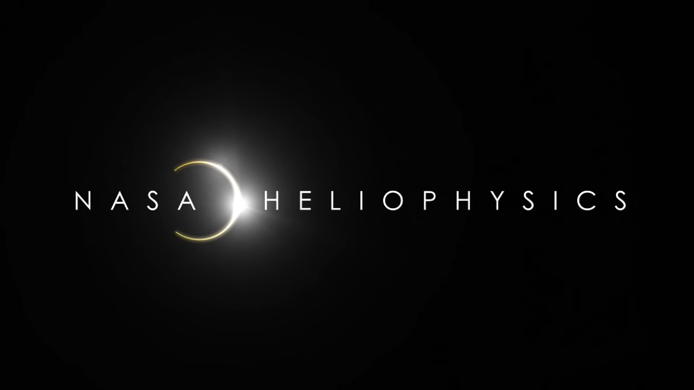

# This is my first GitHub website
## How to get the Sun?
Use `Sunpy` to download, process and display data about **Our Star**.

```python
from sunpy.map import Map

fn = "obs.fits"
my_map = Map(fn)
print("This is my first observation of the Sun")
my_map.peek()
```

## Channels of the Solar Dynamics Observatory

| Channel | Temperature | Layer |
| --- | --- |
| 304 | Quiet cool | Chromosphere |  
| 171 | Not so hot | Photosphere |
| --- | --- |

# TO DO LIST

## Mostly for today, but I can leave it for tomorrow

- [x] Finish the referee report
- [ ] Push my commits to GitHub
- [ ] Go to Doncaster for bball game

## In the words of the great unknown phylosopher:

> The physics have its own laws.

[](https://youtu.be/GSVv40M2aks)